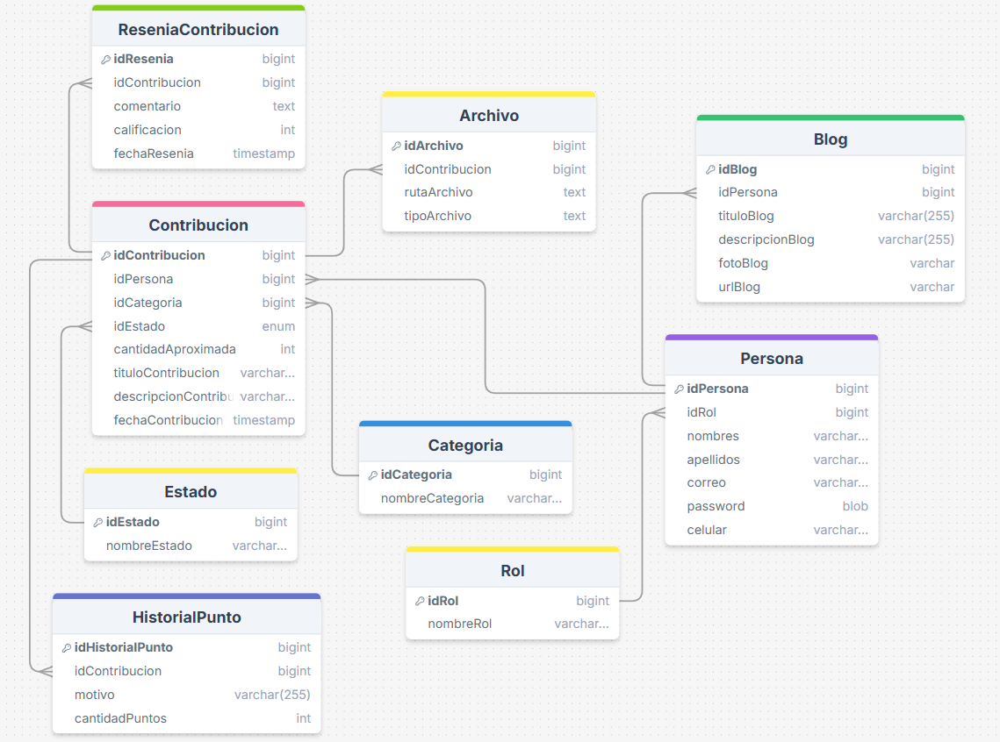

# ♻️ Revalisso  
**Transforma tus objetos en oportunidades.**
<p align="center">

</p>

**Revalisso** es una plataforma web en desarrollo que permite a los usuarios **contribuir con objetos o recursos** y recibir **puntos de recompensa**, que luego pueden **canjear por premios u otros productos**.  
La idea principal es fomentar una cultura basada en la reutilización, la solidaridad y la economía circular.

---

## 🚀 ¿Qué es Revalisso?

Revalisso nace como una solución innovadora para incentivar el intercambio y aprovechamiento de recursos, permitiendo:

- Contribuir con productos que ya no utilizas.
- Acumular puntos por cada contribución validada.
- Canjear puntos por recompensas o beneficios.
- Participar en una red de apoyo y reutilización.

> 🔧 Actualmente, el proyecto aún se encuentra en desarrollo.  

---

## 🛠️ Tecnologías utilizadas

### 🌐 Frontend
- 🅰️ Angular v20
- 🎨 Tailwindcss v3

### 🧠 Backend
- ☕ Spring Boot
- 🐘 PostgreSQL
- 📦 Maven

---

## 🗄️ Vista previa de la base de datos


*Modelo conceptual inicial de la base de datos*

## Datos iniciales a tomar en cuenta

```sql
-- Crear roles
INSERT INTO rol(nombre_rol) VALUES ('USUARIO');
INSERT INTO rol(nombre_rol) VALUES ('ADMIN');

-- Crear estados
insert into estado(nombre_estado) values ('Nuevo');
insert into estado(nombre_estado) values ('Seminuevo');
insert into estado(nombre_estado) values ('Usado');
insert into estado(nombre_estado) values ('Dañado');
```

## Autor
<p align="left">
  <a href="https://github.com/Daniee19">
    
    <br>
    <sub><b>Daniel Castañeda</b></sub>
  </a>
</p>
